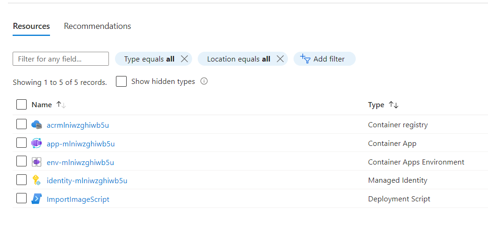
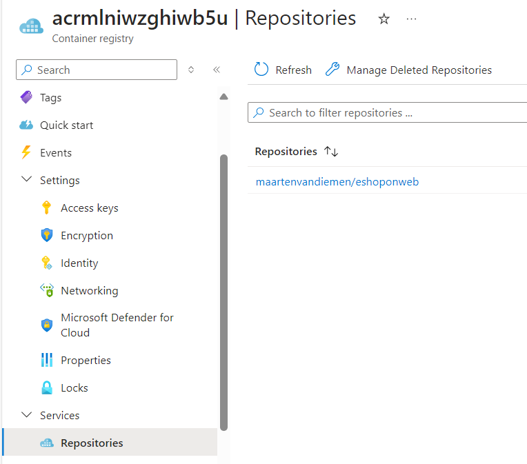
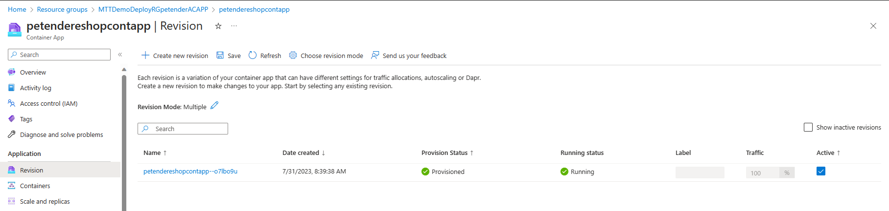
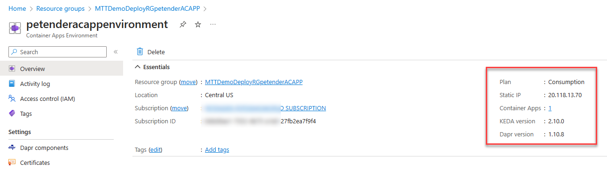
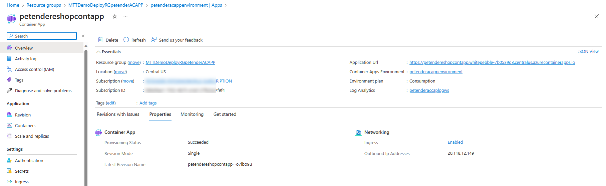
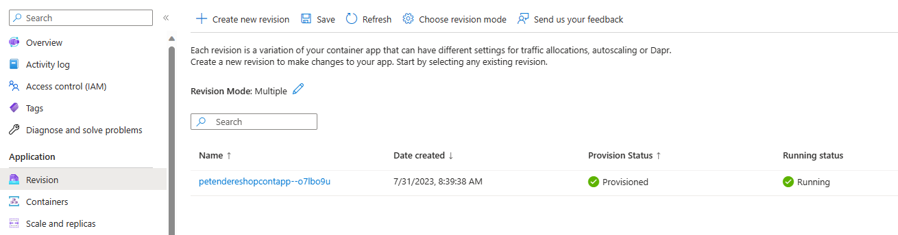
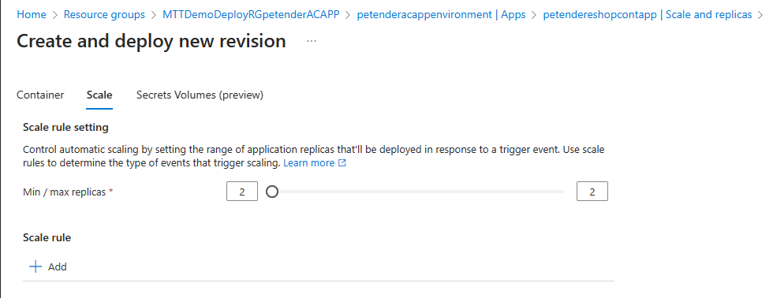
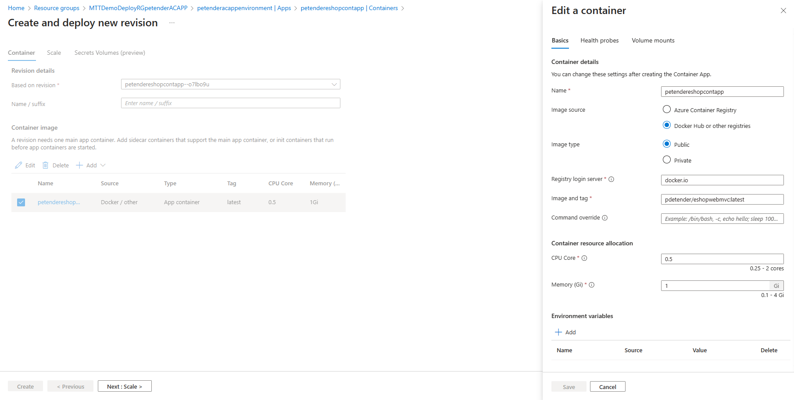
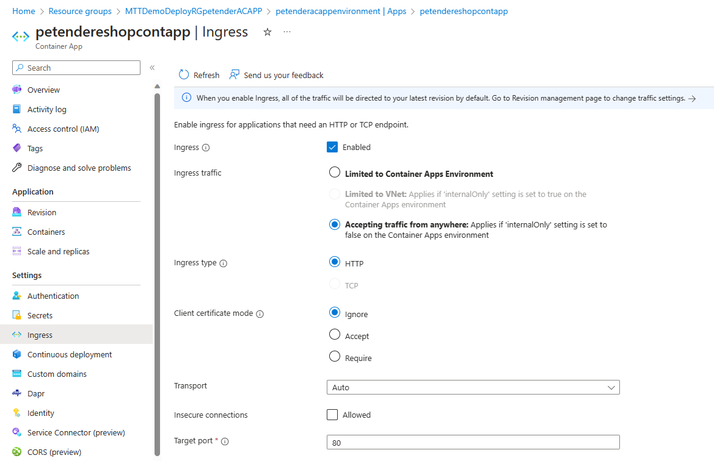

[comment]: <> (please keep all comment items at the top of the markdown file)
[comment]: <> (please do not change the ***, as well as 
 placeholders for Note and Tip layout)
[comment]: <> (please keep the ### 1. and 2. titles as is for consistency across all demoguides)
[comment]: <> (section 1 provides a bullet list of resources + clarifying screenshots of the key resources details)
[comment]: <> (section 2 provides summarized step-by-step instructions on what to demo)

[comment]: <> (this is the section for the Note: item; please do not make any changes here)
***
### EShopOnWeb Retail in Azure Container Apps - demo scenario

**Note:** Below demo steps should be used **as a guideline** for doing your own demos. Please consider contributing to add additional demo steps.

[comment]: <> (this is the section for the Tip: item; consider adding a Tip, or remove the section between 
 and 
 if there is no tip)

**Tip:** The same **EShopOnWeb Retail** application is also available in the **IAAS, PAAS, ACI and AKS scenarios**. If you want to walk learners through the different Azure Architectures, running the same application workload, it's a quite powerful demo.

***
### 1. What Resources are getting deployed
This scenario deploys the sample **.NET EShopOnWeb Retail** application as a running **Azure Container Apps Scenario**, together with **Azure Container Registry**. 

* rg%yourenvironment% - Azure Resource Group.
* acr%uniqueId% - acr with eshopwebmvc container image - Azure Container Registry
* app-%uniqueId% - Running Azure Container Apps
* env-%uniqueId% - Azure Container Apps Environment
* ImportImageScript - Script for importing the docker image from GitHub into ACR (is deleted after on hour)
* Identity-%uniqueId% - Managed User Identity under which the script above is executed

  

  

  

### 2. What can I demo from this scenario after deployment

1. Navigate to the **deployed ACA Resource Group.
1. Describe the different components, and how they are related to each other. (Container Environment reflects the 'behind-the-scenes Kubernetes cluster, Log Analytics is used for monitoring, Container Registry holds the Docker images, Container App is the actual running application).
1. Navigate to **%youralias%acappenvironment** and open its details. 

  

1. From the **Overview** tab, show the **Public IP address** of the running application.
1. From the **Overview** tab, show the **KEDA** version (KEDA is used for scaling the application workload)
1. From the **Overview** tab, show the **Container Apps** is showing "1". This is the number of running instances of the application.
1. Click the **1** reflecting the Container App Instance. This will open the **Container App Instance** details. Open its details.

  

1. Under the **Application** section, notice Revision, Containers and Scale+Replicas.
1. Select **Revision**; Each revision is a variation of your container app that can have different settings for traffic allocations, autoscaling or Dapr.
Create a new revision to make changes to your app. Start by selecting any existing revision.

  

1. For the pre-deployed revision, you can pull up the **Revision URL**, which shows you the running EShopOnWeb Retail application in the browser. 
1. You can also see it is running, and has 2/2 replicas. This means it is running 2 instances of the container app. 
1. Click on **Containers** to see the container image details under the **Properties** section. 

**Note:** Although the scenario deploys an Azure Container Registry, the automated deployment doesn't allow to 'grab' the ACR password; therefore, we are pulling the same Docker image from the publicly available Docker Hub.

1. Click on **Scale+Replicas** to see the scaling details. For now, it is set to run 2 replicas of the container app. Click on **Edit and deploy** in the top menu. 
1. From the **Create and deploy new revision** blade, click **Scale**. 

  

1. Update the **Replicas** to **3** and click **Create**.
1. Back in the **Create and deploy new revision** blade, click **Container**. Next, click the **%alias%eshopwebmvc** container image. This allows you to change the **compute settings** (CPU, Memory) for the runtime containers.
1. 
1. **Copy** the public IP address and **navigate** to the EShopOnWeb Retail application from your browser.

  

1. Navigate to **Settings / Containers**
1. From the **Events**, explain the different actions for getting the container up and running. (pull from registry, started container,...)
1. From the **Properties**, show the ports, as well as the CPU/Memory settings used for this App

   

1. From the **Container App** blade, navigate to **Ingress**. This is what Azure Container Apps uses to expose the application to the outside world. Walk the learners through some of the settings.

    

1. From the **Container App** blade, navigate to **Monitoring / Log Stream**. This allows you a console log view of the running application. You can choose between **Console** logs or **System** logs. Either will be used for tracing and monitoring typically. 

[comment]: <> (this is the closing section of the demo steps. Please do not change anything here to keep the layout consistant with the other demoguides.)
  
***

**Note:** This is the end of the current demo guide instructions.

